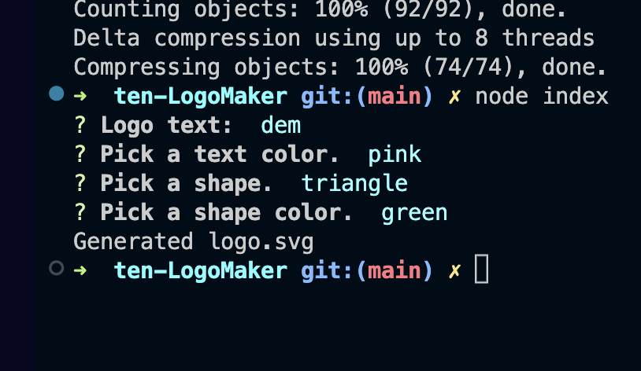
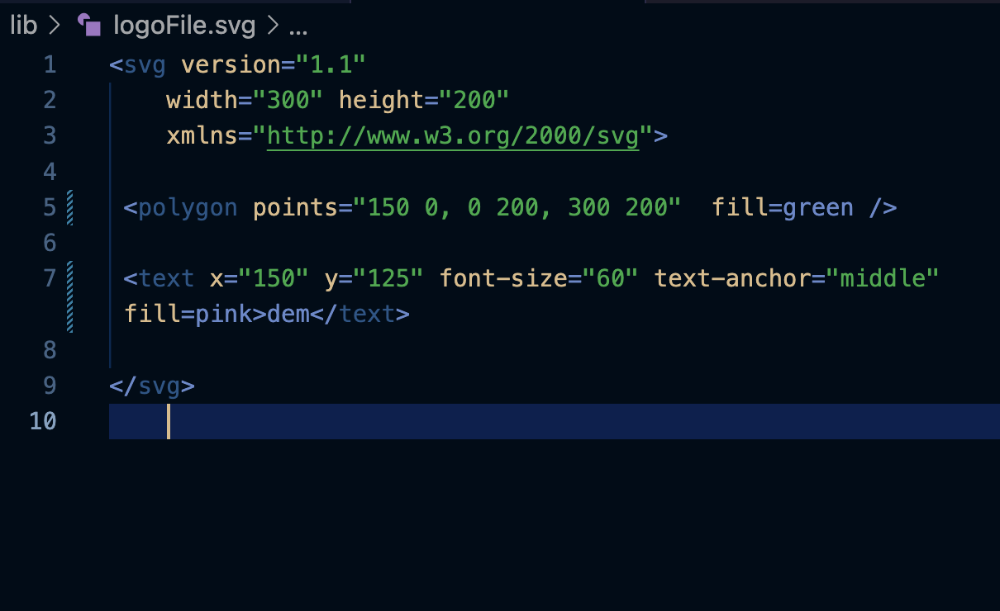
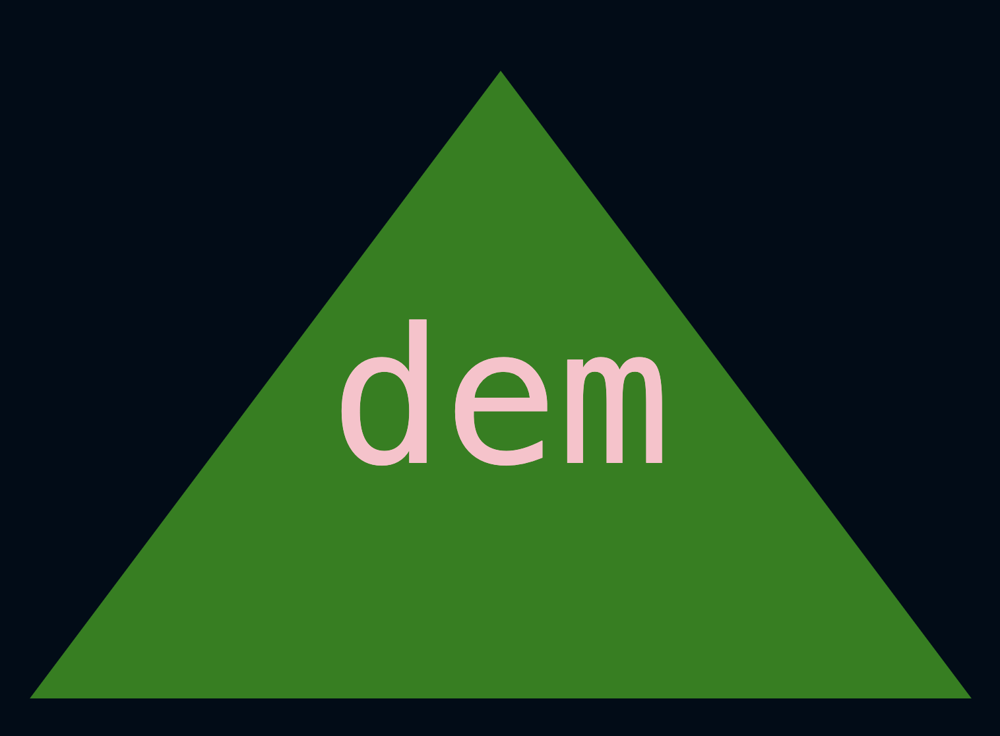

# SVG Logo Generator  
  
 # Table of Contents  
   
1. [Description](#description)  
2. [Installation](#installation)  
3. [Usage](#usage)  
4. [Contributions](#contributions)  
5. [Tests](#tests)  
6. [Questions](#questions)  
7. [Screenshots](#screenshots)  
8. [Links](#links)  
## Description  
Command Line Interface that can be used to generate a simple svg logo either in the shape of a circle, square, or triangle with any shape or text color and choice of up to three characters long.   
  
## Installation  
Any software capable of running javascript and node with the download of the npms downloaded within the file can be using to run this program. This SVG VS Code Extension is also needed to preview the svg file: (download it here) https://marketplace.visualstudio.com/items?itemName=jock.svg.
  
## Usage  
If someone wanted to create a filler logo until they can have another professionally made or they want a very simple logo, this code can be run to generate a svg file with the image they want based on their inputs.  
  
## Contributions  
Yes. In the future, I would like more shape options and font styles.  

   
## Tests   
Run "**npm run test**" to test the program.   
   
## Questions  
Take a closer look at this repo and my other work by visiting my GitHub with the link below, or contact me directly by email.  
GitHub: https://github.com/ShannyaN  
Email: niveyro101@gmail.com  

## Screenshots  
  
 
 

## Links  
Deployed site: N/A  
Repository: https://github.com/ShannyaN/ten-LogoMaker
Video Walk Through: https://drive.google.com/file/d/1k9XvzJ4M4vaE30YOF9qQ_-0U4D5GGl9_/view